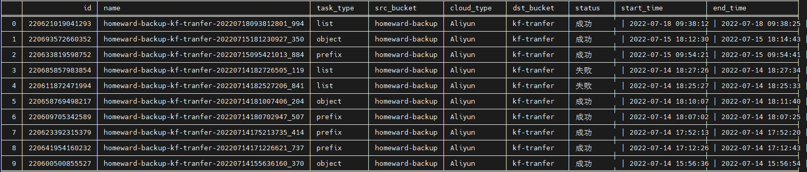

## OMS 服务工具说明文档

#### 目的

该应用方便用户将Aliyun oss桶数据迁移至Huaweiyun OBS桶内


#### 部署
python >= 3.6

| 软件名            |   版本  |
| ----------------- | ------ |
| huaweicloudsdkcore| 3.0.97 |
| huaweicloudsdkoms | 3.0.97 |
| requests          | 2.24.0 |
| tabulate          | 0.8.10 |


部署地：
| IP             |   path                |
| -------------- | --------------------- |
| 114.116.195.106| /nas/pipeline_v2/OMS/ |


#### 使用说明

```python3
./CloudToOBS
usage: CloudToOBS [-h] {create_task,show_task,list_task,start_task,stop_task,delete_task,traffic_task} ...

Aliyun[oss] To HuaWeiYun[obs]

optional arguments:
  -h, --help            show this help message and exit

任务控制台:
  {create_task,show_task,list_task,start_task,stop_task,delete_task,traffic_task}
    create_task         创建任务
    show_task           展示指定任务
    list_task           列出所有任务
    start_task          开始任务(一般用于暂停任务之后)
    stop_task           暂停任务
    delete_task         删除任务
    traffic_task        任务流量控制

```

###### 创建任务
```python3
./CloudToOBS create_task -h
usage: CloudToOBS create_task [-h] (--object_key OBJECT_KEY | --list_file LIST_FILE) [--task_type {prefix,list,url_list,object}]

optional arguments:
  -h, --help            show this help message and exit
  --object_key OBJECT_KEY
                        字符串, 当task_type为prefix/object时, 多个用逗号隔开
  --list_file LIST_FILE
                        文件, 当task_type为list/url_list时使用, 请确认文件已上传至obs桶内
  --task_type {prefix,list,url_list,object}
                        prefix前缀,object指具体文件或者文件名; list/url_list则需要将指定文件写入文本并上传至同一区域可访问的目的桶

```
阿里云路径结构
oss://${bucket_name}/${project_name}/${library}/${any_unkonw}/${filename}

| 任务类型               | 参数类型                         |
| --------------------- | -------------------------------- |
|  prefix/object        | object_key                       | 
|  list/url_list        | list_file                        |

prefix/object: 
```python3
# 迁移oss://${bucket_name}/${project_name}/${library}/${any_unkonw}/目录下文件前缀为201127的文件
```python3
./CloudToOBS create_task --task_type prefix --object_key ${project_name}/${library}/${any_unkonw}/201127

# 迁移目录oss://${bucket_name}/${project_name}/${library}/${any_unkonw}
./CloudToOBS create_task --task_type object --object_key ${project_name}/${library}/${any_unkonw}

# 迁移文件oss://${bucket_name}/${project_name}/${library}/${any_unkonw}/A.report
./CloudToOBS create_task --task_type object --object_key ${project_name}/${library}/${any_unkonw}/A.report
```

list/url_list
```python3
# 创建文件${Afile}(建议使用时间戳, 类似[20220718100024],防止多用户文件覆盖, 保证文件唯一), 将所有需要迁移的文件写入, 格式如下
A.txt:
${project_name}/${library}/${any_unkonw}/A.txt
${project_name}/${library}/${any_unkonw}/b.gz
.
.
.

# 将该文件上传至obs桶(建议目的桶)
obsutil  cp -r object_list_file.txt  obs://${obs_bucket}/

# ./CloudToOBS create_task --task_type list --list_file  ${Afile}

# 关于url_list则只需将${Afile}的文件格式调整为url, 具体url则需要去源桶中获取
```
**Response**
```json
{
    "id": 220621019041293,  // 任务id, 用于后续查询
    "task_name": "homeward-backup-kf-tranfer-20220718093812801_994"  // 任务名
}

```


###### 展示任务详细信息

./CloudToOBS show_task --task_id  220621019041293
```json
{
    "bandwidth_policy": [],
    "complete_size": 129708,
    "description": "",
    "dst_node": {
        "bucket": "kf-tranfer",
        "region": "cn-north-4",
        "save_prefix": ""
    },
    "enable_failed_object_recording": true,
    "enable_kms": false,
    "enable_restore": false,
    "error_reason": null,
    "failed_num": 0,
    "failed_object_record": {
        "result": null,
        "list_file_key": null,
        "error_code": null
    },
    "group_id": "",
    "id": 220621019041293,
    "is_query_over": true,
    "left_time": 0,
    "migrate_since": 0,
    "migrate_speed": 10559,
    "name": "homeward-backup-kf-tranfer-20220718093812801_994",
    "progress": 1.0,
    "real_size": 129708,
    "skipped_num": 0,
    "src_node": {
        "bucket": "homeward-backup",
        "cloud_type": "Aliyun",
        "region": "cn-shenzhen",
        "app_id": "",
        "object_key": [],
        "list_file": {
            "list_file_key": "object_list_file.txt",
            "obs_bucket": "kf-tranfer"
        }
    },
    "start_time": 1658108292801,
    "status": 5,  // 状态1: "等待调度",2: "正在执行",3: "停止",4: "失败",5: "成功"
    "successful_num": 9,
    "task_type": "list",
    "group_type": "NORMAL_TASK",
    "total_num": 9,
    "total_size": 129708,
    "total_time": 12283,
    "smn_info": null,
    "source_cdn": null,
    "success_record_error_reason": null,
    "skip_record_error_reason": null
}
```

###### 列出任务
列出最新20个任务, limit为可选参数, 默认为20
./CloudToOBS --list_task ${id} --limit 20
```
id: 任务id
name: 任务名
task_type: 任务类型
src_bucket: 源桶
cloud_type: 源云类型
dst_bucket: 目的桶
status: 任务状态
start_time: 开始时间
end_time: 结束时间
```



###### 暂停任务
```
./CloudToOBS stop_task  --task_id 220621019041293
执行成功
```

###### 删除任务
```
./CloudToOBS delete_task  --task_id 220621019041293
执行成功
```


###### 任务流量限制
限制220621019041293s上午10点到下午6点带宽为100M
```python3
./CloudToOBS traffic_task --task_id  220621019041293 --start_time 10:00 --end_time 18:00 --bindwidth 104857600
```